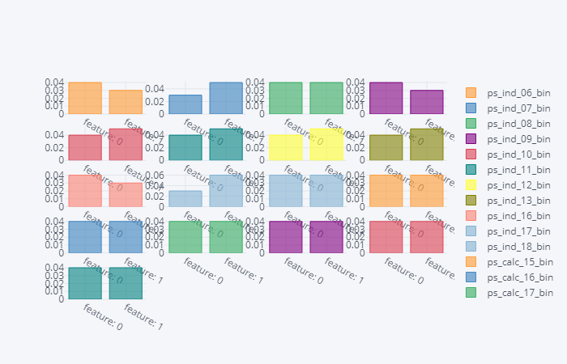

# 索赔情况预测

便签：LightGBM+LR

[TOC]

## 1、背景和目标

背景：

目标：根据所提供的汽车保单持有人的数据建立机器学习模型，分析保单持有人是否会在次年提出索赔。

## 2、分析方法确定

* 该项目中的预测问题为二分类问题，与互联网的广告点击率预测问题相类似
* 数据均已做过脱敏处理，无法通过业务知识对数据特征进行处理

* GBDT集成方法为不断拟合残差的机器学习方法，在数学意义上是直接相加，通过增加LR部分可为其提供权重，因而采用GBDT+LR的方法进行预测

## 3、数据观察与预处理

### 3.1、数据特征分类

```python
values = list(train.columns)[2: ]
cate1 = []
cate2 = []
cate_con_or_ord = []
cat_cols = []
bin_cols = []

for col in train.columns:
    cols = col.split('_')
    if len(cols) == 3:
        cate1.append(cols[1])
        cate2.append('continuous or ordinal')
        cate_con_or_ord.append(col)
    if len(cols) == 4:
        cate1.append(cols[1])
        cate2.append(cols[3])
        if cols[3] == 'cat':
            cat_cols.append(col)
        if cols[3] == 'bin':
            bin_cols.append(col)
columns_df = pd.DataFrame({'category_1': cate1, 'category_2': cate2}, index = values)
```

### 3.2、缺失值数据处理

#### 3.2.1、查看缺失值数据分布情况

```python
import missingno as msno

train_null_values = []
train_col_missing = []

for col in values:
    if len(train[col][train[col].isnull()].index):
        train_null_values.append((col, len(train[col][train[col].isnull()].index)))
        train_col_missing.append(col)
for i in sorted(train_null_values, key = lambda x: x[1], reverse = True):
    print(i)
msno.matrix(train[train_col_missing], color=(0.42, 0.1, 0.05))
```


#### 3.2.2、分析缺失数据间的相关性

```python
msno.heatmap(df = train[train_col_missing])
```


**ps_car_01_cat与ps_ind_02_cat与ps_ind_04_cat正相关**

**ps_car_07_cat与ps_ind_05_cat正相关**

**ps_car_03_cat与ps_car_05_cat正相关**

* 同理，将test数据集的缺失值情况进行可视化


### 3.3、各变量相关性分析

```python
import cufflinks as cf
train[values].corr().iplot(kind = 'heatmap', text = train[values].corr().values)
```


**可见calc类的数据没有相关性**

```python
corr_values = values.copy()
for col in values:
    if 'calc' in col:
        corr_values.remove(col)
train[corr_values].corr().iplot(kind = 'heatmap', colorscale = 'spectral')
```


**ps_ind_16_bin与ps_ind_17_bin与ps_ind_18_bin有强负相关**

**ps_ind_06_bin与ps_ind_07_bin与ps_ind_08_bin与ps_ind_09_bin具有强负相关**

### 3.4、各类特征分析

#### 3.4.1、二分类特征分析

##### 3.4.1.1、训练集二分类空值占比

```python
import cufflinks as cf

train_bin_zero_list = []
train_bin_one_list = []
for col in bin_cols:
    temp = train[col].value_counts()
    zero = temp[0]
    one = temp[1]
    train_bin_zero_list.append(zero)
    train_bin_one_list.append(one)
    
df = pd.DataFrame({'zero_counts': train_bin_zero_list, 'one_counts': train_bin_one_list}, index = bin_cols)
df.iplot(kind = 'bar', barmode = 'stack')
```


* ps_ind_14与ps_ind_10_bin,ps_ind_11_bin,ps_ind_12_bin,ps_ind_13_bin相关，而这4项二分类取零较多，ps_ind_14空值较多

##### 3.4.1.2、测试集二分类取值占比

```python
import cufflinks as cf

test_bin_zero_list = []
test_bin_one_list = []

for col in bin_cols:
    temp = test[col].value_counts()
    test_bin_zero_list.append(temp[0])
    test_bin_one_list.append(temp[1])

pd.DataFrame({'zero_counts': test_bin_zero_list, 'one_counts': test_bin_one_list}, 
             index = bin_cols).iplot(kind = 'bar', barmode = 'stack')
```


##### 各二分类特征target取值占比

```python
train_1 = train[train.target == 1]
train_0 = train[train.target == 0]

k = 0
#plt.figure(figsize = (32, 24))
for col in bin_cols:
    temp0 = train_0[col].value_counts()
    bin_zero_t0 = temp0[0]
    bin_one_t0 = temp0[1]
    temp1 = train_1[col].value_counts()
    bin_zero_t1 = temp1[0]
    bin_one_t1 = temp1[1]
    one_list = (bin_zero_t1 / (bin_zero_t0 + bin_zero_t1), 
                bin_one_t1 / (bin_one_t0 + bin_one_t1))
    if k == 0:
        df = pd.DataFrame({col: one_list}, index = ['feature: 0', 'feature: 1'])
    if k != 0:
        df = pd.concat([df, pd.DataFrame({col: one_list}, 
                                     index = ['feature: 0', 'feature: 1'])], 
                       axis = 1, sort = False).round(2)
    k += 1
df.iplot(kind = 'barh', subplots = True, shape = (5, 4))
```



#### 3.4.2、多分类特征分析

##### 3.4.2.1、特征对target的影响

```python
train_cate = train.fillna(-1).copy()
plt.figure(figsize = (32, 24))
k = 0
for col in cat_cols:
    k += 1
    names = []
    cate_t0 = []
    cate_t1 = []
    one_list = []
    for i in train_cate[col].unique():
        names.append(str(i))
        target = train_cate.loc[train_cate[col] == i, ['target']]
        if len(target['target'].unique()) == 2:
            cate_t0.append(target['target'].value_counts(sort = False)[0])
            cate_t1.append(target['target'].value_counts(sort = False)[1])
        if len(target['target'].unique()) == 1 and target['target'].unique()[0] == 1: 
            cate_t0.append(0)
            cate_t1.append(target['target'].value_counts()[0])
        if len(target['target'].unique()) == 1 and target['target'].unique()[0] == 0:
            cate_t0.append(target['target'].value_counts()[0])
            cate_t1.append(0)
        
    for i in zip(cate_t0, cate_t1):
        one_list.append(i[1] / (i[0] + i[1]))
    plt.subplot(5, 3, k)
    plt.title(col)
    data = pd.DataFrame({'names': names, 'target1 counts': one_list})
    sns.barplot(x = 'names', y = 'target1 counts', data = data)
```


**标记为-1 的值是空值，可看出空值对target具有影响，后续需要将空值标记为一种类别**

##### 3.4.2.2、各特征取值数量占比

```python
k = 0
plt.figure(figsize = (32, 24))
for col in cat_cols:
    k += 1
    names = list(train[col].value_counts().index.astype('str'))
    counts = list(train[col].value_counts().values.astype('float64'))
    if col in train_col_missing:
        names.append('NaN')
        counts.append(len(train[col]) - sum(counts))
    plt.subplot(5, 3, k)
    plt.title(col)
    data = pd.DataFrame('names': names, 'counts': counts)
    sns.barplot(x = 'names', y = 'counts', data = data)
```


**ps_car_08_cat实际上是二分类，ps_car_11_cat更接近为连续变量**

```python
k = 0
plt.figure(figsize = (32, 24))
for col in cat_cols:
    k += 1
    names = list(test[col].value_counts().index.astype('str'))
    counts = list(test[col].value_counts().values.astype('float64'))
    if col in test_col_missing:
        names.append('NaN')
        counts.append(len(test[col]) - sum(counts))
    plt.subplot(5, 3, k)
    plt.title(col)
    data = pd.DataFrame({'names': names, 'counts': counts})
    sns.barplot(x = 'names', y = 'counts', data = data)
```


#### 3.4.3、顺序与连续特征分析

```python
list1 = []
for col in cate_con_or_ord:
    list1.append((col, len(train[col].unique())))
for i in sorted(list1, key = lambda x: x[1], reverse = True):
    print(i)
```

```
('ps_car_13', 70482)
('ps_reg_03', 5013)
('ps_car_14', 850)
('ps_car_12', 184)
('ps_calc_10', 26)
('ps_calc_14', 24)
('ps_calc_11', 20)
('ps_reg_02', 19)
('ps_car_15', 15)
('ps_ind_15', 14)
('ps_calc_13', 14)
('ps_ind_03', 12)
('ps_calc_06', 11)
('ps_calc_08', 11)
('ps_calc_12', 11)
('ps_reg_01', 10)
('ps_calc_01', 10)
('ps_calc_02', 10)
('ps_calc_03', 10)
('ps_calc_07', 10)
('ps_ind_01', 8)
('ps_calc_09', 8)
('ps_calc_05', 7)
('ps_calc_04', 6)
('ps_ind_14', 5)
('ps_car_11', 5)
```

**ps_car_13、ps_reg_03、ps_car_14、ps_car_12是连续变量，剩下的为顺序变量**

##### 3.4.3.1、顺序变量的直方图

```python
conti_cols = ['ps_car_13', 'ps_reg_03', 'ps_car_14', 'ps_car_12']
conti_or_ord = cate_con_or_ord.copy()
for i in conti_cols:
    conti_or_ord.remove(i)
    
k = 0
plt.figure(figsize = (32, 24))
for col in conti_or_ord:
    k += 1
    plt.subplot(5, 5, k)
    #plt.title(col)
    plt.ylabel('counts')
    sns.distplot(train[col].dropna(), kde = False, color = 'g')
```


```python
conti_cols = ['ps_car_13', 'ps_reg_03', 'ps_car_14', 'ps_car_12']
conti_or_ord = cate_con_or_ord.copy()
for i in conti_cols:
    conti_or_ord.remove(i)
    
k = 0
plt.figure(figsize = (32, 24))
for col in conti_or_ord:
    k += 1
    plt.subplot(5, 5, k)
    #plt.title(col)
    plt.ylabel('counts')
    sns.distplot(test[col].dropna(), color = 'g', kde = False)
```


***可看出数据分布不是正态分布，在后续处理空值数据时，应该选用中位数***

##### 3.4.3.2、连续变量的带KDE曲线直方图

```python
k = 0
plt.figure(figsize = (32, 24))
for col in conti_cols:
    k += 1
    plt.subplot(2, 2, k)
    plt.title(col)
    plt.ylabel('counts')
    sns.distplot(tuple(train[col].dropna()))
```


```python
k = 0
plt.figure(figsize = (32, 24))
for col in conti_cols:
    k += 1
    plt.subplot(2, 2, k)
    plt.title(col)
    plt.ylabel('counts')
    sns.distplot(tuple(test[col].dropna()))
```


##### 3.4.3.2、顺序变量对target的影响

```python
train_rank = train[conti_or_ord].copy()
train_rank = train_rank.dropna()
train_rank['target'] = train['target']
train_rank1 = train_rank[train_rank['target'] == 1]
train_rank0 = train_rank[train_rank['target'] == 0]

k = 0
plt.figure(figsize = (32, 24))
for col in conti_or_ord:
    k += 1
    trace1 = []
    trace0 = []
    names = []
    one_list = []
    for i in train_rank[col].unique():
        names.append(i)
        trace1.append(len(train_rank1[train_rank1[col] == i]))
        trace0.append(len(train_rank0[train_rank0[col] == i]))
    for (x, y) in zip(trace0, trace1):
        one_list.append(y / (x + y))
    plt.subplot(6, 4, k)
    plt.title(col)
    data = pd.DataFrame({'names': names, 'target1': one_list})
    sns.barplot(x = 'names', y = 'target1', data = data)
```


##### 3.4.3.3、对不同target取值的连续变量做KDE密度曲线图

```python
train_rank_count = train[conti_cols].copy()
train_rank_count['target'] = train['target']
train_rank_count = train_rank_count.dropna()
train_rank0_count = train_rank_count[train_rank_count['target'] == 1]
train_rank1_count = train_rank_count[train_rank_count['target'] == 0]


k = 0
plt.figure(figsize = (32, 24))
for col in conti_cols:
    k += 1
    plt.subplot(2, 2, k)
    sns.kdeplot(train_rank0_count[col])
    sns.kdeplot(train_rank1_count[col])
```


对这几个特征而言，target=1 意味着它们的密度曲线顶峰会低一些，局部最小点会高一些，曲线会平滑一些，但是大体来说，分布没有发生根本的改变

##### 3.4.3.4、有缺失数据的顺序或连续数据对target取值的影响、

```python
train_missing_cont_ord = list(set(train_col_missing).intersection(set(cate_con_or_ord)))
train_rank_missing_cont_ord = train[train_missing_cont_ord].copy()
train_rank_missing_cont_ord['target'] = train['target']
train_rank0_missing_cont_ord = train_rank_missing_cont_ord[
    train_rank_missing_cont_ord['target'] == 0]
train_rank1_missing_cont_ord = train_rank_missing_cont_ord[
    train_rank_missing_cont_ord['target'] == 1]

k = 0
#plt.figure(figsize = (32, 24))
for col in train_missing_cont_ord:
    
    rank0_col_missing = train_rank0_missing_cont_ord[col].isnull().sum()
    rank0_col_unmissing = len(train_rank0_missing_cont_ord) - rank0_col_missing
    rank1_col_missing = train_rank1_missing_cont_ord[col].isnull().sum()
    rank1_col_unmissing = len(train_rank1_missing_cont_ord) - rank1_col_missing
    one_list = (rank1_col_missing / (rank1_col_missing + rank0_col_missing), 
                   rank1_col_unmissing / (rank1_col_unmissing + rank0_col_unmissing))
    if k == 0:
        data = pd.DataFrame({col: one_list}, index = ['miss', 'unmiss'])
    else:
        data = pd.concat([data, pd.DataFrame({col: one_list}, index = ['miss', 'unmiss'])])
    k += 1
data.iplot(kind = 'bar', subplots = True, shape = (2, 2))
```


***对于ps_car_11，ps_car_12，缺失值意味着 target 不会等于 1，但缺失值个数分别为1和5，因此该信息不那么重要***

## 4、数据处理

### 4.1、缺失值处理

* 对于多分类特征，将其缺失值作为新特征
* 对于顺序或连续特征，用中位数填充空值

```python
train_clean = train.copy()
for col in cat_cols:
    train_clean[col].fillna(-1, inplace = True)
train_clean['ps_reg_03_miss'] = np.zeros(len(train))
train_clean.loc[train_clean['ps_reg_03'].isnull(), 'ps_reg_03_miss'] = 1
train_clean['ps_car_14_miss'] = np.zeros(len(train))
train_clean.loc[train_clean['ps_car_14'].isnull(), 'ps_car_14_miss'] = 1

test_clean = test.copy()
for col in cat_cols:
    test_clean[col].fillna(-1, inplace = True)
test_clean['ps_reg_03_miss'] = np.zeros(len(test))
test_clean.loc[test_clean['ps_reg_03'].isnull(), 'ps_reg_03_miss'] = 1
test_clean['ps_car_14_miss'] = np.zeros(len(test))
test_clean.loc[test_clean['ps_car_14'].isnull(), 'ps_car_14_miss'] = 1

for col in ['ps_car_11', 'ps_car_12']:
    train_clean[col].fillna(train_clean[col].median(), inplace = True)
    test_clean[col].fillna(test_clean[col].median(), inplace = True)
```

```python
train_clean['missing_total_0'] = np.zeros(len(train_clean))
train_clean['missing_total_1'] = np.zeros(len(train_clean))
train_clean['missing_total_2'] = np.zeros(len(train_clean))

train_clean.loc[train_clean['ps_ind_04_cat'] == -1, 'missing_total_0'] += 1
train_clean.loc[train_clean['ps_car_01_cat'] == -1, 'missing_total_0'] += 1
train_clean.loc[train_clean['ps_ind_02_cat'] == -1, 'missing_total_0'] += 1

train_clean.loc[train_clean['ps_car_03_cat'] == -1, 'missing_total_1'] += 1
train_clean.loc[train_clean['ps_car_05_cat'] == -1, 'missing_total_1'] += 1

train_clean.loc[train_clean['ps_ind_05_cat'] == -1, 'missing_total_2'] += 1
train_clean.loc[train_clean['ps_car_07_cat'] == -1, 'missing_total_2'] += 1
```

 

```python
test_clean['missing_total_0'] = np.zeros(len(test_clean))
test_clean['missing_total_1'] = np.zeros(len(test_clean))
test_clean['missing_total_2'] = np.zeros(len(test_clean))

test_clean.loc[test_clean['ps_ind_04_cat'] == -1, 'missing_total_0'] += 1
test_clean.loc[test_clean['ps_car_01_cat'] == -1, 'missing_total_0'] += 1
test_clean.loc[test_clean['ps_ind_02_cat'] == -1, 'missing_total_0'] += 1

test_clean.loc[test_clean['ps_car_03_cat'] == -1, 'missing_total_1'] += 1
test_clean.loc[test_clean['ps_car_05_cat'] == -1, 'missing_total_1'] += 1

test_clean.loc[test_clean['ps_ind_05_cat'] == -1, 'missing_total_2'] += 1
test_clean.loc[test_clean['ps_car_07_cat'] == -1, 'missing_total_2'] += 1
```

### 4.2、二分类特征处理

由相关性分析，将相关性较强的二分类特征进行相加构建成新特征

```python
train_clean['bin_plus_0'] = train_clean[
    'ps_ind_06_bin'] + train_clean[
    'ps_ind_07_bin'] + train_clean['ps_ind_08_bin'] + train_clean['ps_ind_09_bin']
train_clean['bin_plus_1'] = train_clean[
    'ps_ind_16_bin'] + train_clean['ps_ind_17_bin'] + train_clean['ps_ind_18_bin']
train_clean['bin_plus_0'].value_counts()
```

***仅有一个值“1”，则必然有一个特征无效，此时需要选择一个特征从train_clean和test_clean数据集中剔除***

```python
train_clean['bin_plus_0'] = train_clean['ps_ind_06_bin'] + train_clean['ps_ind_07_bin'
                                                      ] + train['ps_ind_08_bin']
train_clean.drop('ps_ind_09_bin', axis = 1)
test_clean.drop('ps_ind_09_bin', axis = 1)

test_clean['bin_plus_0'] = test_clean['ps_ind_06_bin'] + test_clean['ps_ind_07_bin'
                                                   ] + test_clean['ps_ind_08_bin'] 
test_clean['bin_plus_1'] = test_clean['ps_ind_16_bin'] + test_clean['ps_ind_17_bin'
                                   ] +test_clean['ps_ind_18_bin']
```

```python
k = 0
temp0 = train_clean[train_clean['target'] == 0]
temp1 = train_clean[train_clean['target'] == 1]

plt.figure(figsize = (32, 24))
for col in ['bin_plus_0', 'bin_plus_1']:
    
    names = []
    one_list = []
    for fea in temp0[col].unique():
        names.append(fea)
        temp0_fea = len(temp0[temp0[col] == fea])
        temp1_fea = len(temp1[temp1[col] == fea])
        one_list.append(temp1_fea / (temp0_fea + temp1_fea))
    if k == 0:
        df = pd.DataFrame({ col: one_list}, index = names)
    else:
        df = pd.concat([df, pd.DataFrame({col: one_list}, index = names)], axis = 0)
    k += 1
df.iplot(kind = 'bar', subplots = True, shape = (1, 2))
```


### 4.3、多分类特征处理

* 将多分类保存一份副本，当成顺序或连续变量，用中值填充空值

```python
cat_cols.remove('ps_car_08_cat')
cat_cols.remove('ps_car_11_cat')

for col in cat_cols:
    name = '%s_rank'%(col)
    train_clean[name] = train_clean[col].replace(-1, np.nan)
    train_clean[name] = train_clean[name].fillna(train_clean[name].median())
    test_clean[name] = test_clean[col].replace(-1, np.nan)
    test_clean[name] = test_clean[name].fillna(test_clean[name].median())
```

* 将相关性较差的calc特征去除

```python
train_clean.drop(['ps_calc_01', 'ps_calc_02', 'ps_calc_03', 'ps_calc_04', 'ps_calc_05', 
                  'ps_calc_06', 'ps_calc_07', 'ps_calc_08', 'ps_calc_09', 'ps_calc_10', 
                  'ps_calc_11', 'ps_calc_12', 'ps_calc_13', 'ps_calc_14', 'ps_calc_15_bin',
                  'ps_calc_16_bin', 'ps_calc_17_bin', 'ps_calc_18_bin', 'ps_calc_19_bin', 
                  'ps_calc_20_bin'], axis = 1)
test_clean.drop(['ps_calc_01', 'ps_calc_02', 'ps_calc_03', 'ps_calc_04', 'ps_calc_05', 
                  'ps_calc_06', 'ps_calc_07', 'ps_calc_08', 'ps_calc_09', 'ps_calc_10', 
                  'ps_calc_11', 'ps_calc_12', 'ps_calc_13', 'ps_calc_14', 'ps_calc_15_bin',
                  'ps_calc_16_bin', 'ps_calc_17_bin', 'ps_calc_18_bin', 'ps_calc_19_bin', 
                  'ps_calc_20_bin'], axis = 1)
```

## 5、数据建模

```python
import lightgbm as lgb
from sklearn.model_selection import train_test_split
y = train_clean['target']
x = train_clean.drop(['id', 'target'], axis = 1)
x_train, x_test, y_train, y_test = train_test_split(x, y, 
                                                    test_size = 0.2, random_state = 100)
lgb_train = lgb.Dataset(x_train, y_train)
lgb_eval = lgb.Dataset(x_test, y_test, reference = lgb_train)

params = {
    'task': 'train',
    'boosting': 'gbdt',
    'objective': 'binary',
    'metric': 'binary_logloss',
    'num_leaves': 16,
    'num_iterations': 25,
    'learning_rate': 0.01,
    'feature_fraction': 0.9,
    'bagging_fraction': 0.8,
    'bagging_freq': 5,
    'verbose': 1
         }
gbm = lgb.train(params, lgb_train, num_boost_round = 100, valid_sets = lgb_train)
y_train_pred = gbm.predict(x_train, pred_leaf = True)
transformed_training_matrix = np.zeros([len(y_train_pred),
                                        len(y_train_pred[0]) * params['num_leaves']], 
                                       dtype = np.int64)
for i in range(0, len(y_train_pred)):
    temp = np.arange(len(y_train_pred[0])) * params[
        'num_leaves'] + np.array(y_train_pred[i])
    transformed_training_matrix[i][temp] += 1
    
from sklearn.linear_model import LogisticRegression
lm = LogisticRegression(penalty = 'l2', C = 0.05)
lm.fit(X = transformed_training_matrix, y = y_train)
y_pred_test = lm.predict_proba(transformed_testing_matrix)

from sklearn.metrics import log_loss
log_loss(y_test, y_pred_test)
```

output: 0.15411123534862636